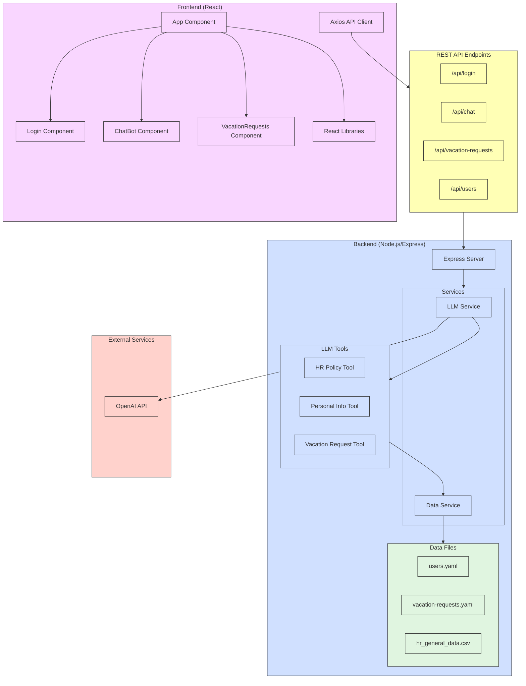

# Application Architecture

Below is a diagram representing the architecture of our Employee Portal application:

## Architecture Overview

This application follows a client-server architecture with:

### Frontend
- React-based single-page application
- Component-based structure for different features (Login, ChatBot, VacationRequests)
- Axios for API requests to the backend

### Backend
- Express.js server
- Services:
  - LLM Service: Handles AI interactions using OpenAI
  - Data Service: Manages data operations
- Tools:
  - HR Policy Tool: Retrieves HR policy information
  - Personal Info Tool: Manages user information
  - Vacation Request Tool: Processes vacation requests

### Data Storage
- File-based storage using YAML and CSV files

### External Services
- OpenAI API for chat bot functionality

### API Endpoints
- `/api/login`: User authentication
- `/api/chat`: Chat bot interactions
- `/api/vacation-requests`: Vacation request management (admin only)
- `/api/users`: User management (admin only)

## Data Flow

1. Users interact with the frontend React components
2. Requests are sent via Axios to the Express backend API endpoints
3. The backend processes requests using appropriate services
4. For chat functionality, the LLM service communicates with OpenAI
5. Data is stored and retrieved from YAML and CSV files
6. Responses are returned to the frontend for display to the user 